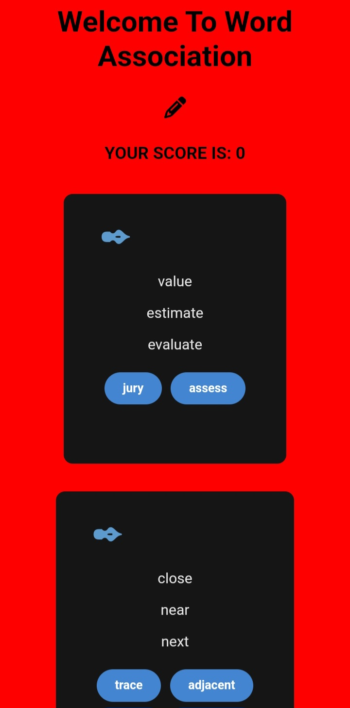
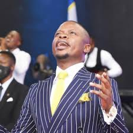

# Word Association Game

## Description
The Word Association Game is a multiplayer game that challenges players to think of associations for a presented word. Players take turns presenting words and guessing the associations for each other's words. The player who guesses the correct association earns a point. The game ends when one player reaches a set goal.

## Link to the deployed site, final project blog article, author(s) LinkedIn:
* https://word-association.unicornplatform.page
* https://link.medium.com/5YC88RQLsAb
* https://www.linkedin.com/in/major-l
* https://www.linkedin.com/in/michelle-chatikobo
## Installation
The game requires no installation as it is played online via the deployed page
## Usage
The game can be played by any person of any age group
## Related products
Theres various word games online that are similar to this one. Similare names are 'Words with Friends', 'Word Connect' and so much more.
## Licensing
This game has no licensing retriction. Feel free to modify or add any code as you see fit to enhance it to your specification.
## Technical details
In the Word Association Game, users are presented with a prompt word and are given a short amount of time (usually five seconds) to come up with another word that is related to the prompt word. The game is designed to be fast-paced and interactive, and users are encouraged to use their own knowledge and creativity to come up with unique and interesting word associations.

From a technical perspective, the game requires real-time processing of user inputs and the generation of new prompt words based on the user's responses. It also includes a scoring system that awards points to users for coming up with words that are related to the prompt word. Additionally, the game requires a user interface that is easy to use and navigate, and that can handle the incoming and outgoing data in real-time.

## Story/Inspiration behind the project
Just as God had created the world with words, we as project engineers are believers in Christ Jesus and therefore believe in the creative abilities of words. Words have power to heal and give life to people. This is why we felt the need to touch peoples hearts through words.

