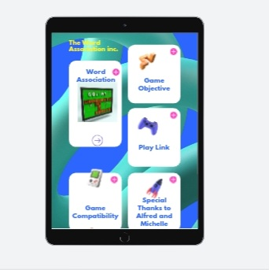

# Word Association Game

## Description
The Word Association Game is a multiplayer game that challenges players to think of associations for a presented word. Players take turns presenting words and guessing the associations for each other's words. The player who guesses the correct association earns a point. The game ends when one player reaches a set goal.
